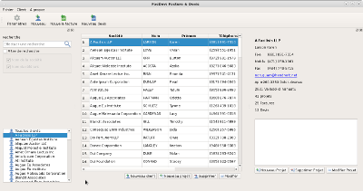

FactDev
=======

  

# Team
FACT team is a team for Universitiy Project. Members of this team are : 
- Florent Berbie ([KraTuX31](https://github.com/KraTuX31 KraTuX31))
- Antoine de Roquemaurel ([aroquemaurel](https://github.com/aroquemaurel))
- Cédric Rohaut ([Oxynos](https://github.com/Oxynos))
- Manantsoa Andriamihary Razanajatovo ([manantsoa](https://github.com/manantsoa))
 
For more informations, you can go to http://fact-team.github.io.

# What is FactDev ? 

 FactDev is a software for quotes and billings developped by FACT team for university project in Toulouse III University – Paul Sabatier.

This software is developped with C++ and Qt framework, and there is differents features :
- Customers database
- Differents projects for customers
- Quotes
- Billings

# Documentation
You can access to the documentation generated by Doxygen here : 
- [HTML Documentation](http://fact-team.github.io/doc/html/index.html)
- [PDF Documentation](http://fact-team.github.io/doc/latex/refman.pdf)

# Installation and using
- [User Manual](http://fact-team.github.io/doc/usermanual.pdf)

# New developpers
New developpers, thank you to read the workflow. Sorry, it is in french.
- [Workflow features](https://github.com/FACT-Team/FactDev/wiki/Workflow)
